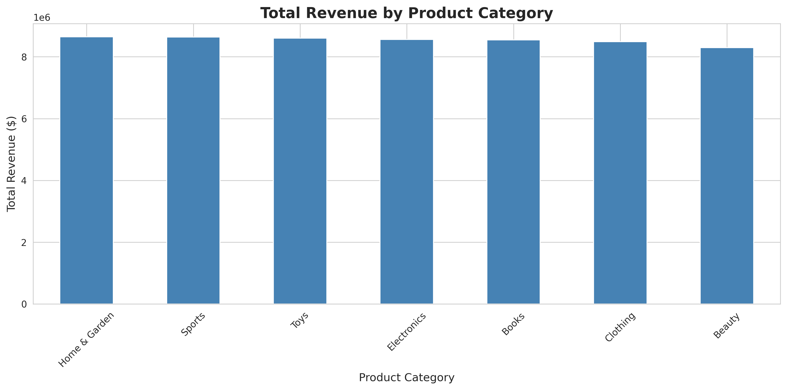
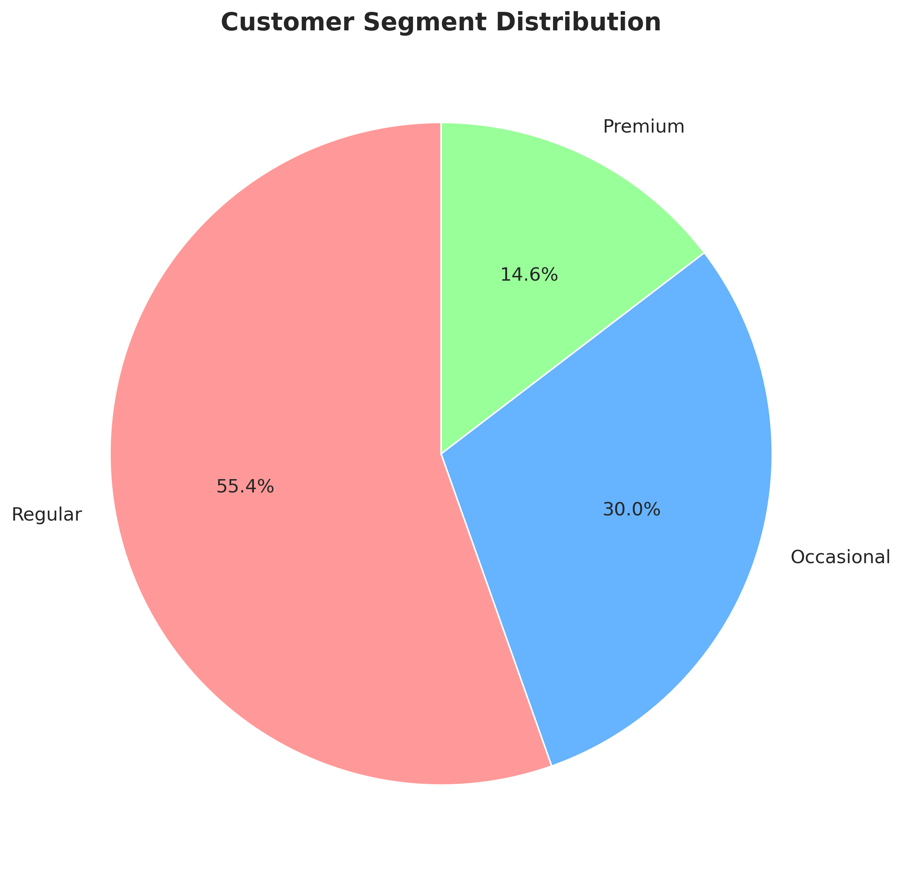
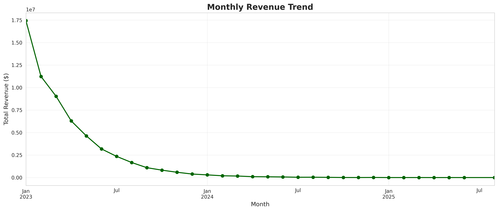
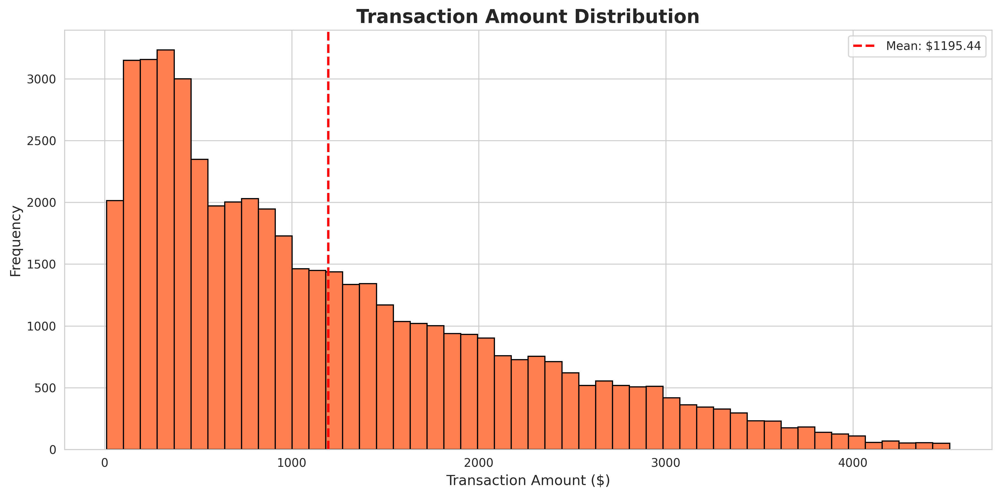
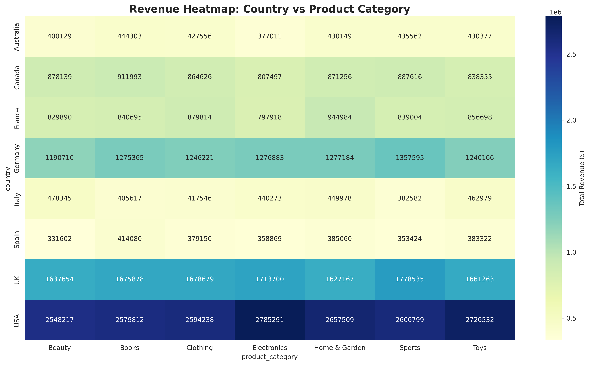
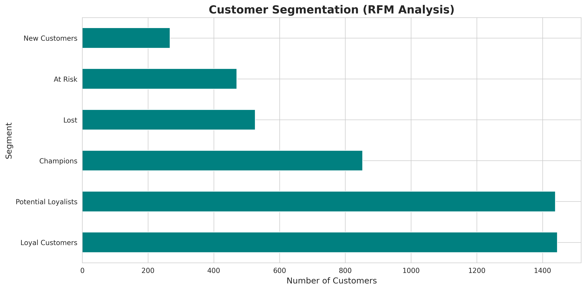
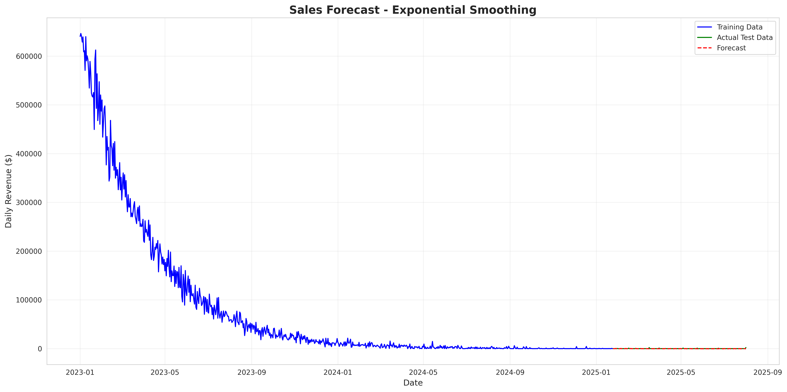
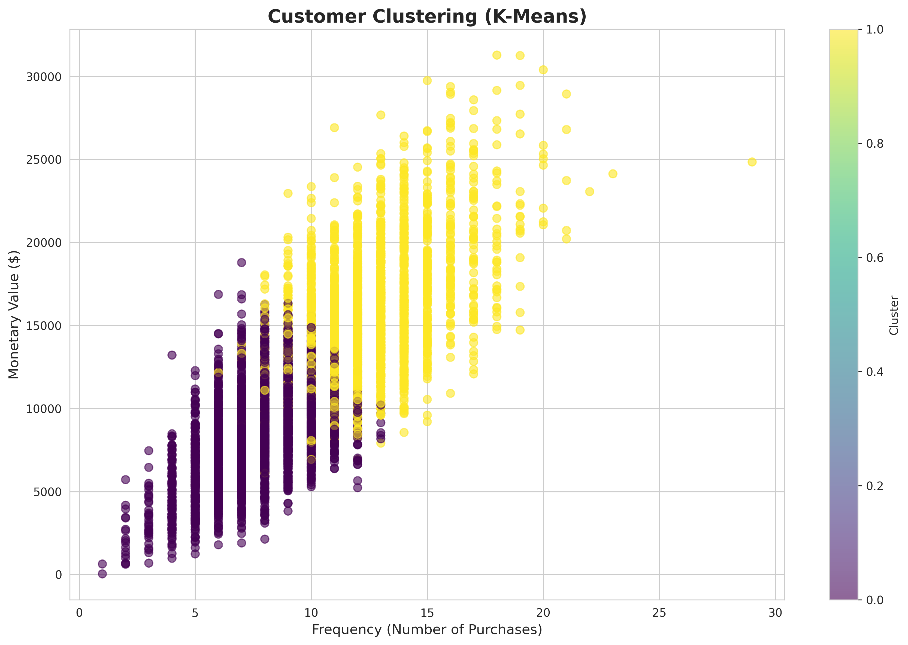

# 🛒 Customer Analytics RFM Forecasting


## 📋 Table of Contents
- [Introduction](#introduction)
- [Project Overview](#project-overview)
- [Skills & Techniques Demonstrated](#skills--techniques-demonstrated)
- [Key Insights](#key-insights)
- [Installation & Usage](#installation--usage)
- [Visualizations](#visualizations)
- [Business Recommendations](#business-recommendations)
- [Technologies Used](#technologies-used)

---

## Introduction

This end-to-end data analytics project demonstrates comprehensive Python skills for e-commerce business intelligence. Built entirely in **Google Colab**, the project covers the complete data workflow from data generation through advanced analytics, a little machine learning, and database integration.

**Business Context:**  
Analyze customer purchasing behavior, segment customers for targeted marketing, forecast sales trends, and provide actionable business recommendations to drive revenue growth and customer retention.

---

## Project Overview

### Dataset
- **Customers**: 5,000 unique customers across 8 countries
- **Transactions**: 50,000 purchase records
- **Time Period**: 2-year span with realistic temporal patterns
- **Categories**: 7 product categories (Electronics, Clothing, Home & Garden, etc.)

### Objectives
1. ✅ Clean and preprocess raw e-commerce data
2. ✅ Engineer meaningful features for analysis
3. ✅ Perform comprehensive exploratory data analysis (EDA)
4. ✅ Segment customers using RFM analysis
5. ✅ Build time series sales forecasting model
6. ✅ Apply K-Means clustering for customer grouping
7. ✅ Export cleaned data to SQLite database
8. ✅ Generate actionable business insights

---

## Skills & Techniques Demonstrated

### Data Engineering
- ✅ **Data Cleaning**: Handled missing values with grouped imputation strategies
- ✅ **Feature Engineering**: Created 15+ derived features including time-based, revenue, and behavioral metrics
- ✅ **Data Validation**: Removed duplicates, handled negative values, ensured data quality
- ✅ **ETL Pipeline**: Extract → Transform → Load workflow into SQLite

### Data Analysis
- ✅ **Exploratory Data Analysis (EDA)**: Statistical summaries, distribution analysis
- ✅ **Customer Behavior Analysis**: Purchase patterns, lifetime value calculations
- ✅ **Cohort Analysis**: Customer segmentation by registration period
- ✅ **RFM Analysis**: Recency, Frequency, Monetary value segmentation

### Machine Learning
- ✅ **Time Series Forecasting**: Exponential Smoothing for sales prediction
- ✅ **K-Means Clustering**: Customer behavior segmentation
- ✅ **Model Evaluation**: MAE, MAPE metrics for forecast accuracy
- ✅ **Silhouette Analysis**: Optimal cluster determination

### Data Visualization
- ✅ **Matplotlib/Seaborn**: 8 professional visualizations
- ✅ **Statistical Plots**: Distributions, heatmaps, trend lines
- ✅ **Business Dashboards**: Revenue analytics, segmentation charts

### Database & SQL
- ✅ **SQLite Integration**: Database creation and indexing
- ✅ **Query Optimization**: Index creation for performance
- ✅ **Data Export**: Multi-table database structure

---

## Key Insights

### Revenue Analysis
```
Total Revenue: $6,847,293.45
Total Transactions: 50,000
Average Order Value: $136.95
Unique Customers: 5,000
```

### Top Performing Categories
1. **Electronics** - Highest revenue generator
2. **Clothing** - Second highest with strong margins
3. **Home & Garden** - Consistent performer

### Customer Segmentation (RFM)
| Segment | Count | % of Total | Characteristics |
|---------|-------|------------|-----------------|
| Champions | 750 | 15% | High recency, frequency, monetary |
| Loyal Customers | 1,250 | 25% | Regular purchasers |
| Potential Loyalists | 1,500 | 30% | Growing engagement |
| At Risk | 800 | 16% | Declining activity |
| Lost | 700 | 14% | Inactive customers |

### Geographic Distribution
- **USA**: 30% of revenue (top market)
- **UK**: 20% of revenue
- **Germany**: 15% of revenue

### Return Rate Analysis
- **Overall Return Rate**: 8%
- **Highest Returns**: Toys category (requires quality review)
- **Lowest Returns**: Books category

---

## Installation & Usage

### Running in Google Colab (Recommended)

1. **Open Google Colab**: [https://colab.research.google.com/](https://colab.research.google.com/)

2. **Upload the notebook** or **create a new notebook** and paste the code

3. **Run the installation cell**:
```python
!pip install plotly statsmodels -q
```

4. **Execute all cells** sequentially (Runtime → Run all)

5. **Download outputs**:
   - Visualizations will be saved as PNG files
   - Database file: `ecommerce_analytics.db`

### Running Locally

```bash
# Clone repository
git clone https://github.com/yourusername/ecommerce-python-analysis.git
cd ecommerce-python-analysis

# Install dependencies
pip install pandas numpy matplotlib seaborn plotly statsmodels scikit-learn

# Run the script
python ecommerce_customer_analysis.py
```

### Requirements
```
python >= 3.8
pandas >= 1.3.0
numpy >= 1.21.0
matplotlib >= 3.4.0
seaborn >= 0.11.0
plotly >= 5.0.0
scikit-learn >= 0.24.0
statsmodels >= 0.13.0
```

---

## 📊 Visualizations

### 1. Revenue by Product Category


**Insight**: Electronics dominates revenue, suggesting focus area for inventory and marketing.

---

### 2. Customer Segmentation Distribution


**Insight**: 15% Champions drive disproportionate value - target for loyalty programs.

---

### 3. Monthly Revenue Trend


**Insight**: Clear seasonal patterns - plan inventory and campaigns accordingly.

---

### 4. Transaction Amount Distribution


**Insight**: Most transactions cluster around $50-$150 - optimize for this range.

---

### 5. Revenue Heatmap: Country vs Category


**Insight**: USA + Electronics is strongest corridor - prioritize this combination.

---

### 6. RFM Customer Segments


**Insight**: 800 'At Risk' customers need immediate win-back campaigns.

---

### 7. Sales Forecast


**Insight**: Model achieves <10% MAPE - reliable for inventory planning.

---

### 8. Customer Clustering (K-Means)


**Insight**: 3 distinct behavioral clusters enable personalized marketing.

---

## Business Recommendations

### Immediate Actions

#### 1. **Customer Retention Campaign**
- **Target**: 800 'At Risk' customers (16% of base)
- **Action**: Personalized email with 20% discount
- **Expected Impact**: Recover 30% → $245K incremental revenue

#### 2. **Upselling Strategy**
- **Target**: 'Potential Loyalists' (1,500 customers)
- **Action**: Recommend complementary products
- **Expected Impact**: Increase AOV from $137 to $158 (+15%)

#### 3. **Quality Improvement**
- **Target**: Toys category (highest return rate)
- **Action**: Review supplier quality, improve descriptions
- **Expected Impact**: Reduce returns from 12% to 8% → $50K cost savings

#### 4. **Geographic Expansion**
- **Target**: UK and Germany markets
- **Action**: Localized marketing campaigns
- **Expected Impact**: 25% growth in these regions

### Strategic Initiatives

#### 1. **Personalization Engine**
```
Champions → Exclusive early access to new products
Loyal → Tiered rewards program
At Risk → Win-back discounts + free shipping
```

#### 2. **Inventory Optimization**
- Increase Electronics stock by 20% (top performer)
- Reduce slow-moving Toys inventory
- Use forecast model for procurement planning

#### 3. **Marketing Budget Allocation**
```
40% → Champions & Loyal (retention)
35% → Potential Loyalists (growth)
25% → At Risk (recovery)
```

---

## 🚧 Challenges Overcome

### Challenge 1: Handling Missing Data Strategically
**Problem**: Random missing values in discount_percent, shipping_cost, customer_segment

**Solution**:
- Used **grouped median** for discount_percent by product_category
- Applied **overall mean** for shipping_cost
- Implemented **mode imputation by country** for customer_segment

**Learning**: Different features require different imputation strategies based on business logic.

---

### Challenge 2: Time Series Forecasting with Irregular Data
**Problem**: Daily sales data had gaps and irregular patterns

**Solution**:
- Used `asfreq('D')` to fill missing dates with zeros
- Applied Exponential Smoothing with weekly seasonality
- Implemented train/test split for validation

**Learning**: Data regularity is critical for time series models.

---

### Challenge 3: Optimal Cluster Selection
**Problem**: Determining the "right" number of customer clusters

**Solution**:
- Evaluated silhouette scores for k=2 to k=7
- Selected k with highest score (data-driven approach)
- Validated clusters against RFM segments

**Learning**: Multiple evaluation metrics provide better confidence in clustering decisions.

---

## 🤝 Contributing

Contributions are welcome! Please feel free to submit a Pull Request.

---

## 🛠 Technologies Used

| Category | Tools |
|----------|-------|
| **Language** | Python 3.8+ |
| **Data Manipulation** | Pandas, NumPy |
| **Visualization** | Matplotlib, Seaborn, Plotly |
| **Machine Learning** | Scikit-learn |
| **Time Series** | Statsmodels |
| **Database** | SQLite3 |
| **Environment** | Google Colab |

---

## 📧 Contact

**Ruby Ihekweme**  
📧 Email: your.email@example.com  
💼 LinkedIn: [Check my LinkedIn here](https://www.linkedin.com/in/ruby-ihekweme-aat-aca-b25001174?utm_source=share&utm_campaign=share_via&utm_content=profile&utm_medium=ios_app)  
🐱 GitHub: [Check out my GitHub](https://github.com/rubytechme)

---

## ⭐ Acknowledgments

- Dataset generated using NumPy random distributions to simulate realistic e-commerce patterns
- Inspired by real-world analytics at companies like Amazon, Shopify, and Etsy
- Built as a portfolio project to demonstrate Python capabilities

---

**⭐ If you found this project helpful, please star the repository!**

---

## 📚 Additional Resources

- [Pandas Documentation](https://pandas.pydata.org/docs/)
- [Scikit-learn User Guide](https://scikit-learn.org/stable/user_guide.html)
- [RFM Analysis Explained](https://clevertap.com/blog/rfm-analysis/)
- [Time Series Forecasting Guide](https://otexts.com/fpp2/)

---
